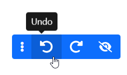
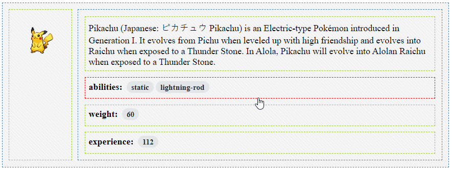
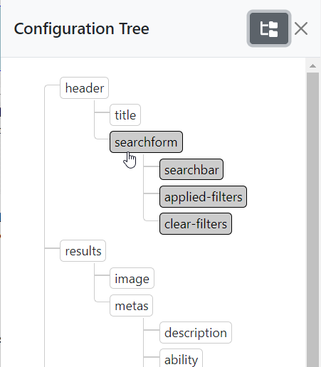
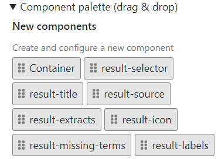
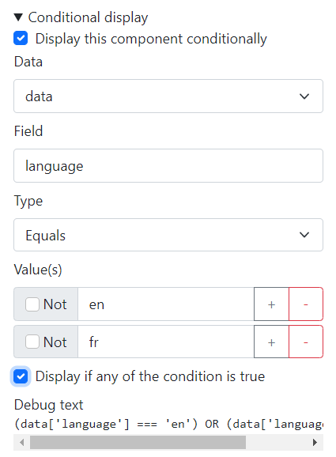

[](https://github.com/sinequa/ngx-ui-builder/actions/workflows/main.yml)
[](https://badge.fury.io/js/@sinequa%2Fngx-ui-builder)

# UI Builder

_An Angular library for creating no-code tools & applications._

- [Documentation](https://sinequa.github.io/ngx-ui-builder/)
- [Demo application](https://sinequa.github.io/ngx-ui-builder/demo)
- [API Reference](https://sinequa.github.io/ngx-ui-builder/compodoc)

**UI Builder** is an Angular library that lets developers create applications that can be easily reshaped and reconfigured by end-users through point-and-click and drag-and-drop interactions.


## Getting Started

Add the library to your application with:

```
ng add @sinequa/ngx-ui-builder
```

(This command installs the library and its peer dependencies from npm)

Import the 2 following modules in your `app.module.ts`:

```ts
import { StoreModule } from "@ngrx/store";
import { ConfigModule } from '@sinequa/ngx-ui-builder';

@NgModule({
    imports: [
        ...
        // Mandatory as we depends on NgRx to undo/redo actions
        StoreModule.forRoot({}),
        ConfigModule
    ]
})
```

Import the Bootstrap utilities and UI Builder stylesheets in your project's stylesheet:

```scss
@import "bootstrap/dist/css/bootstrap-utilities.min"; // Unless you already use Bootstrap or Bootstrap utilities
@import "@sinequa/ngx-ui-builder/styles/ui-builder";
```

(Note that the Bootstrap utilities should not affect the styling of your app: they only introduce convenience styling such as `display: flex` for the class name `d-flex`)

Initialize the configuration service with a blank configuration:

```ts
import { ConfigService } from '@sinequa/ngx-ui-builder';

...
export class AppComponent {

  constructor(
    public configService: ConfigService
  ){
    this.configService.init([]);
  }
```

Create a first zone in your application:

```html
<uib-zone id="test">
    <ng-template uib-template="test">
        <h1>Hello world</h1>
    </ng-template>
</uib-zone>
```

Display the configurator and toolbar (wrapped under a `.uib-bootstrap` element, so that these components are correctly styled):

```html

<div class="uib-bootstrap">

    <uib-toolbar>

    <!-- Inject custom toolbar buttons here -->

    </uib-toolbar>

    <uib-configurator>

    <!-- Inject custom configurators here -->

    </uib-configurator>

</div>
```

## Usage

### Introduction

A normal Angular application has HTML templates that look like this:

```html
<div *ngFor="let product of products">
    <h3>{{product.name}}</h3>
    
    <p>{{product.description}}</p>
    <div>
        <span>EUR {{product.price}}</span>
        <button (click)="buy(product)">Add to basket</button>
    </div>
</div>
```

This template is fine, but it is static. If you need to change the layout, or change the price currency from "EUR" to "USD", then you need a developer to modify the app and rebuild it.

**What if the developer could transform the app into a set of modular building blocks, and let the users do what they want, with the simplicity of drag & drop and configuration forms?**

With UI Builder, this can be achieved with the following steps:

1. Replace the above template with a "zone", including the sub-templates that users will drag & drop and configure.
2. Define your default layout with configuration.
3. Insert a configurator, with optional configurators for each sub-template

### 1) Create a zone

A zone is defined like this:

```html
<uib-zone id="products" [data]="products">

    <!-- Product name -->
    <ng-template uib-template="name" let-data="data">
        <h3>{{data.name}}</h3>
    </ng-template>

    <!-- Product description -->
    <ng-template uib-template="description" let-data="data">
        <p>{{data.description}}</p>
    </ng-template>

    <!-- Product image -->
    <ng-template uib-template="image" let-data="data">
        
    </ng-template>

    <!-- Product price -->
    <ng-template uib-template="price" let-data="data" let-config>
        <span>{{config.currency}} {{product.price}}</span>
        <button (click)="buy(product)">Add to basket</button>
    </ng-template>

</uib-zone>
```

We pass a list of templates to the zone by transclusion. These templates are just regular Angular templates. They may include one or multiple Angular components, or just plain HTML. Notice that these templates have 2 inputs: `data` and `config`. `data` corresponds to _variable_ data (such as the product price displayed in this example). `config` corresponds to any other parameter that does not depend on the data (like the price currency).

### 2) Define a default layout

The zone defined above will display components according to a given configuration. This configuration should be initialized when the application starts.

In order to display one of the templates defined above, the configuration must include:
- A configuration object for that template
- A "container" that references that template

Every "zone" should have a "container" configuration corresponding to the "root" of these HTML elements:

```
zone "products"
|_ container "products"
  |_ template "name"
  |_ template "description"
  |_ template "image"
  |_ template "price"
```

Note that this structure can be hierarchical, as containers can include other containers.

This arborescence of configuration is defined like this:

```ts
import {Component, OnInit} from '@angular/core';
import {ConfigService} from 'ngx-ui-builder';

export class MyComponent implements OnInit {

    constructor(
        public configService: ConfigService
    ){}

    ngOnInit() {
        this.configService.init([{
            id: 'products',
            type: '_container',
            items: ['name', 'description', 'image', 'price']
        },{
            id: 'price',
            type: 'price',
            currency: 'EUR'
        }]);
    }
}
```

Notice that:
- Each configuration object is passed to the template, hence why it is possible to use the parameters with bindings like this: `<span>{{config.currency}}</span>`
- It is possible to omit a trivial configuration object, if it does not have any configuration, like the "name", "description" and "image" templates. The library automatically creates a `{id: 'name', type: 'name'}` object
- There is no obligation to have an equal `id` and `type`. In fact, the same template can be displayed multiple times, with different input configurations. The only constraint is that `id` must be unique, and `type` must refer to a template name (see [Step 1](#1-create-a-zone))

At this point, the application is functional: the zone should display the templates, according to the configuration tree.

### 3) Insert a configurator

The configurator is a component from the UI Builder library which is displayed when the user clicks on a component to configure it. It can display several built-in forms as well as (optional) custom forms corresponding to each of your templates.

Like for the zones, the custom configurators are passed by transclusion.

```html
<uib-configurator>

    <ng-template uib-template="price" let-context>
        <!-- Currency selector -->
        <label for="currency">Currency</label>
        <select [(ngModel)]="context.config.currency" id="currency" (ngModelChange)="context.configChanged()">
            <option value="EUR">Euro</option>
            <option value="USD">Dollar</option>
        </select>
    </ng-template>

</uib-configurator>
```

## Features

### State management

Configuration is at the heart of the UI Builder: It defines which components are displayed, their visual layout and which parameters they use.

Configuration is managed in a reactive store based on [NgRx](https://ngrx.io/), [Immer](https://immerjs.github.io/immer/) and [ngrx-wieder](https://github.com/nilsmehlhorn/ngrx-wieder). ngrx-wieder includes a state history which powers **Undo**/**Redo** buttons. Therefore, every action on the configuration (moving a component with drag & drop, creating a new component, or modifying its parameters) is undoable.



Any change to the configuration is immediately visible in the UI, giving users a "what you see is what you get experience" (Wysiwyg).

Configuration can be easily synced with a server so that users always retrieve the application in the state they left it.

### Hierarchical containers

A container is a built-in type of component that displays sub-components (whose ids are listed in the `items` property):

```js
{
    id: 'products',
    type: '_container',
    items: ['name', 'description', 'image', 'price']
}
```

Containers can contain other containers, which can contain other containers, and so on. This allows to create arbitrarily complex layouts, with rows nested into columns, nested into rows, etc.



### Configuration tree

The configuration tree can be used to visualize the configuration of each components. It represents the hierarchy of components within containers, within containers (etc.), within each zone.

It also allows to see the location of a component and select it directly, rather than having to look for it in the UI.



### Drag & drop

Components can be dragged and dropped intuitively within their zone. A component can be moved within its container, or within a different container.

Drag & drop can also be used to drag new components in from a palette, or for removing a component from its zone.

Drag & Drop is powered by the [ngx-drag-drop](https://reppners.github.io/ngx-drag-drop/) library.

### Component palettes

Palettes of components are generated automatically based on the templates available to a zone. If a zone has 3 templates, then the palette will let you drag & drop any of those 3 templates anywhere into the zone, multiple times if needed.

Additionally, the palette lets users drag & drop new containers into existing containers.

When a template has a custom configurator, this configurator is displayed in a modal prior to insertion, so that the user can initialize its configuration properly.



### Form templates

Components can have completely custom templates. These templates are passed by transclusion to the `uib-configurator` component, and are displayed when the user selects the component with a click, directly in the UI, or from the configuration tree.

Simply pass a configurator template with the same name as the component template (in this case, "foo"):

```html
<uib-zone id="my-zone">
    <!-- Component template -->
    <ng-template uib-template="foo" let-config>
        <h1>Hello world</h1>
        <p *ngIf="config.showText">Lorem Ipsum...</p>
    </ng-template>
</uib-zone>

...

<uib-configurator>
    <!-- Configurator template -->
    <ng-template uib-template="foo" let-context>
        <input type="checkbox" id="text" [(ngModel)]="!!context.config.showText" (ngModelChange)="context.configChanged()">
        <label for="text">Show text</label>
    </ng-template>
</uib-configurator>
```

### Custom layouts

Containers use [CSS flexbox](https://developer.mozilla.org/en-US/docs/Web/CSS/CSS_Flexible_Box_Layout) to display inner elements with a wide range of options (direction, alignment, wrapping, etc.)

Containers have a built-in configurator for configuring these flexbox property visually.


### Conditional display

Sometimes a component should be displayed only in certain conditions. In a normal Angular application, one can simply use `*ngIf` to define these conditions.

With the UI Builder, users can configure conditions by using the "Conditional display" form:



In the above form:
- "Data" corresponds to the `[data]` input passed to the `<uib-zone>` component. It is possible to pass additional objects to a zone via `[conditionsData]`.
- "Field" corresponds to the field name of the data object.
- "Type" can be "equals", or "regular expression", for more complex use cases
- "Values" lists all the values that the condition should verify. "Not" allows to negate the condition, and "Display if any of the conditions is true" allows to switch between "AND" and "OR" when there are multiple values.

### Style encapsulation

The library is dependent on [Bootstrap](https://getbootstrap.com/) for the styling of its components (configurator, toolbar, built-in forms).

However Bootstrap does not have to be loaded globally in the host application (as it may conflict with another styling framework). Instead, we encapsulate the Bootstrap CSS within a `.uib-bootstrap` selector.

This means the library can be integrated in the host application with the following pattern:

```html
<div class="uib-bootstrap">

    <uib-toolbar></uib-toolbar>

    <uib-configurator>

        ...

    </uib-configurator>
</div>
```

However, the host application still requires some additional styling and utilities to correctly display the dynamic components within a `<uib-zone>`.

These styles can be integrated with the following lines:

```scss
@import "bootstrap/dist/css/bootstrap-utilities.min";
@import "ngx-ui-builder/styles/ui-builder";
```

(Obviously, the first line can be omitted if you already use Bootstrap in your host application)

### Static export

Customizing applications with UI Builder comes at a cost:
- The source code of the application becomes more complex
- The application becomes slower, as a result of being completely dynamic (templates are displayed as a result of a changing configuration)

So, at some point, it may be desirable to take the configuration and "convert it" into a normal, static, Angular application.

This can be achieved with one line of Angular CLI:

```
ng generate ngx-ui-builder:make-static -- --config=my-config.json
```

The `make-static` schematic takes as an input a JSON file containing the configuration of your application and generates HTML template(s) with the right templates in the right positions and with the right parameters passed as inputs. It also takes care of removing the `<uib-zone>`, `<uib-toolbar>` and `<uib-configurator>` components from your app, as well as the import of the ui-builder stylesheet.

After running this script, the app should compile and display your components exactly the same as before, but without a trace of the UI Builder in them anymore!

### Internationalization

The library has standard Angular i18n support.

Running `ng extract-i18n` for an application using ngx-ui-builder will extract all the strings marked for translation.
